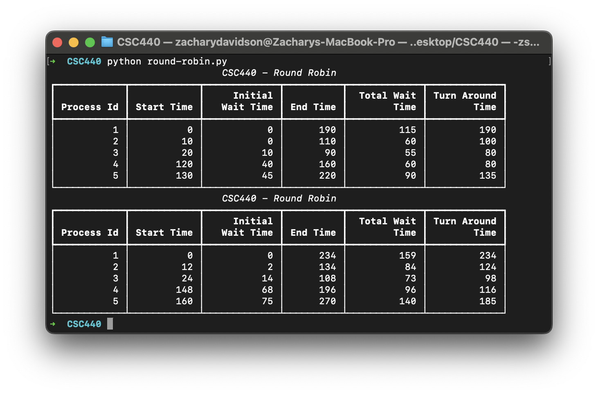

# Round Robin 

## Description

Create a round robin for CSC440

## Table of Contents
- [Results](#results)
- [Installation](#installation)
- [Usage](#usage)

## Results

Results for TQ: 10, context switch 2 && TQ: context switch: 2

## Installation

Ensure you have Python installed. Install rich with pip to generate the table. 'pip install rich'

## Usage

Run 'python round-robin.py'

