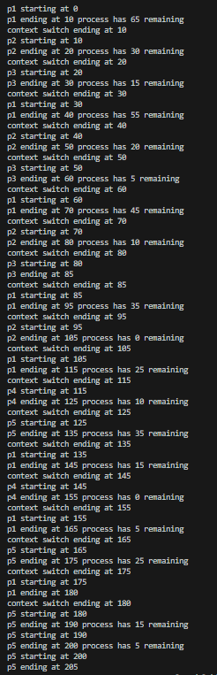

# Round Robin and SQRR

## Description

A novel Sliding Quantum Round Robin CPU scheduling algorithm created while exploring the traditional Round Robin scheduling algorithm with Python.  

## Table of Contents
- [Traditional Results](#traditional-results)
- [A Novel SQRR](#a-novel-sqrr)
- [SQRR Final Results](#sqrr-final-results)
- [Drawbacks and Future Work](#drawbacks-and-future-work)
- [Installation](#installation)
- [Usage](#usage)

## Traditional Results

Results for TQ: 10, context switch 10  TQ: context switch: 2

Note: This implementation checks the arrival time of each process before it starts and does not maintain a rotating queue. A copy of the processes is created by the setQueue method and each iteration of the inner loop checks if the process has arrived yet. Further revisions can be made to implement a rotating queue. This implementation works great at reducing intial wait time, but may sacrifice turn around time. 

By itself, this is not very useful. Future revisions could look at comparing a remaining time to quantum + context ratio that can complete near complete processes. Although, I believe this may make the overall scheduling more efficent in theory, it would create too much overhead in practice. 

 

Round Robin serves as a FCFS algorithm by executing the inner loop of the of the queue. Different methods of implementation can create surprisingly different results. The first images shows a 0 context time, and a time quantum of 10. In Figure, p3 should switch to p4, however the loop breaks off and the queue restarts from the beginning. This behavior could be avoided by maintaining a circular queue on the Round Robin class. 

## A Novel SQRR 

A novel algorithm was created and dubbed the "Sliding Quantum Round Robin" (SQRR). The need for this algorithm arose when noticing substantial waiting and turn around times using randomly generated data with traditional round robin. 

The SQRR is a traditional round robing utilizing two new improvements:

1. Waiting times can be reduced by sorting processes in the queue by their service time in ascending order. Allowing shorter processes to execute first allows these processes to avoid waiting for context switches between longer processes. 

2. Recalculating the quantum of each queue iteration based on an average of the process service times in the queue. If there is only one process in the queue, the quantum will not let the process finish on the first iteration because this could cause starvation to incoming processes if the executing process has an especially long service time. 

## SQRR Final Results

Further optimizations were made to the SQRR algorithm by incorporating a single optimization:

1. A condition was added to finish an executing process if 50% of the adjusted quantum is remaining. In the same way that sorting helps to avoid waiting for context switches, final step eliminates a context switch for each process. However, there is a draw back that is discussed below. 

Here are the final results:

## Limitations and Future Work

It's important to note that results of the SQRR algorithm are based upon the ratio of a service range of 4-8 units and an arrival range of 5-10 units. As the ratio changes, especially in relation to context switch time, the performance of the algorithm may or may not yield the same results. For example, best results between these service and arrival ranges combined with a context switch of 2 and traditional, static round robin quantum time of 2 are seen with nearly a 10x improvement in average wait and turn around time. 

A drawback of the remaining 50% execution condition of the SQRR algorithm is that a potentially large time quantum may produce starvation of the remaining processes. 

## Installation

Ensure you have Python installed. Install rich with pip to generate the table. Run'pip install rich'

## Usage

Run 'python round-robin.py'

